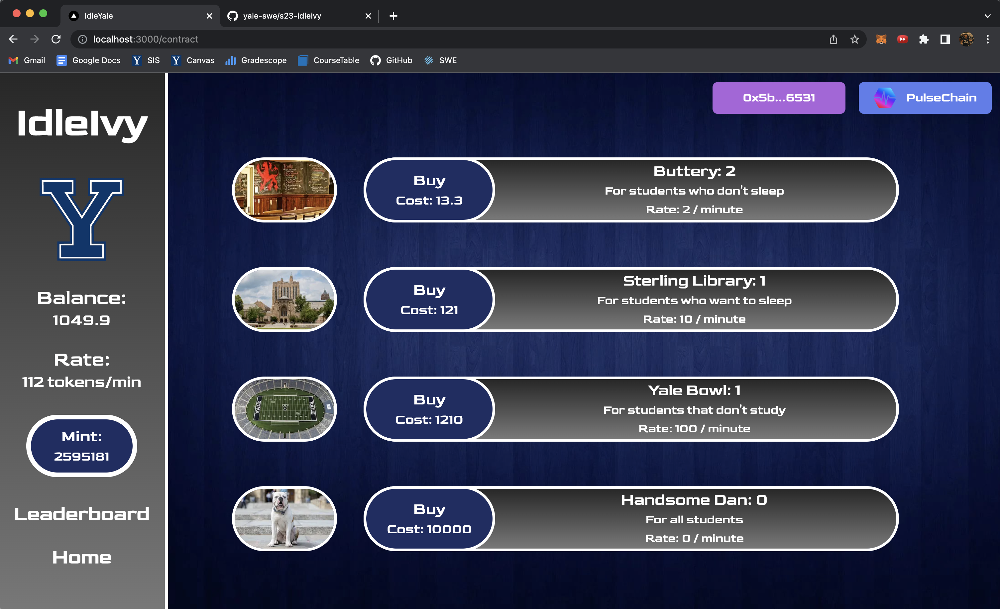

# IdleIvy

<p align="center">
    <br>
</p>

# About
IdleIvy is an Ivy League themed idle game for users who are interested in crypto and fans of this style of gameplay. The in-game currency is in the form of cryptocurrency tokens that are provided via a Blockchain smart contract that is hosted on the Ethereum network or a testnet. Players can then use these tokens in the game to upgrade their items to increase their tokens earned per minute rate.

## Tech Stack

We will be developing a Next.js application using React for our frontend and Python with Flask as our backend. The game will be based on a Blockchain smart contract hosted on either the Ethereum network or a testnet. User data will be stored partially on the Blockchain and partially in a mySQL database.

# How to Deploy
Add and create a wallet in Metamask. This can be downloaded and added as a google chrome extension very easily. This will create a crypto wallet for you, so take the steps you find necessary to keep your private key safe.

Once you have metamask installed, go to "Add Network" and at the Pulsechain V3 network.
- Network Name: PulseChain Testnet V3
- New PRC URL: https://rpc.v3.testnet.pulsechain.com
- Chain ID: 942
- Currency Symbol: tPLS

Once the chain is added, go to "https://faucet.v3.testnet.pulsechain.com/" to recieve 10 free tPLS. This will require connecting your wallet to the site and being on the Pulsechain V3 network. This should auto fill your address in the input box and then you can follow the steps to recieve your 10 tPLS.

At this point you're all set up to play the game. Just go to the local version you have running and follow the steps. For any questions please reach out to Gabriel Sleenhof. The web3 aspect of this project can take some getting used to if you haven't seen how it works.

## Run Frontend
Run "npm i" in your terminal from the s23-idleivy/idlyivy directory to make sure you have any imports installed. Next, run "npm run dev" in the same terminal and directory. 
Go to localhost:3000 to access the game.

## Run Backend
To set up the Flask server locally, follow these steps:
1. Install homebrew if you do not have it already - https://docs.brew.sh/Installation
2. Open a new terminal window and cd to s23-idleivy/FlaskAPI
3. Create a virtual environment - you can do this by running the following commands:
```shell
brew install virtualenv
virtualenv testenv
source testenv/bin/activate
```  
This will create a virtual environment called virtualenv where you can run the Flask server.
4. Run "pip3 install -r requirements.txt" to install all required modules.
5. To run the server locally, run "python server.py".


# Testing
## Backend Testing
We use pytest to conduct elementary unit tests on our Flask API endpoints. The tests check that each API function is able to run and exit with the correct exit status given the correct form and request type. To run the backend testing, simply use the command
```shell
pytest -rm
```
From within the FlaskAPI directory. 


## Frontend Testing

We have been using the Jest testing framework for unit testing on the frontend. Here, we included screenshot testing to ensure the enitre page and any included Next.js components are rendered correctly. We also test to make sure the HTML tags contain the correct innerHTML text to be displayed to users.

To run the frontend tests, navigate to the root directory (s23-idleivy), then run these commands:

```shell
cd idlyivy/__tests__/frontend_tests
npm test
```
## Adding Tests
To add a backend test, edit the "test_db.py" file in the FlaskAPI directory. 

# Metrics Milestone
On the home page (index.js) of our idle game, we have buttons associated with some Ivy League schools (Yale, Harvard, Princeton) that navigate the user to the version of our game that is themed after the selected school. At the time of this milestone, the Yale themed version of the game is the one we have fully implemented, so we tested the Yale button of interest for better conversion performance by changing the text displayed in the buttons between these three options: ["Click here to play!", "Play now!", "Play the game!"]. We used the epsilon-greedy algorithm that shows one of these options randomly 30% of the time, and the other 70% of the time it displays the option with the best ratio between the number of times users clicked the button and the number of times it was displayed to users. We found that displaying "Play now!" had the highest conversion percentage among users. The code for all of this is in the index.js page (s23-idleivy/idlyivy/pages/index.js). 

*Would like to credit Clockwork as we used their metric milestone as inspiration!